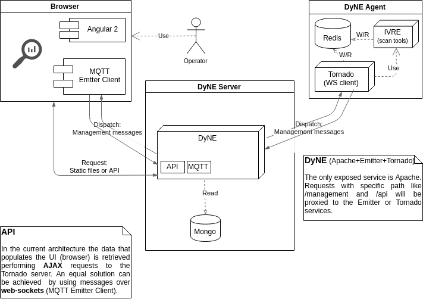

# Preface

A NCI Agency cyber security team has the need to know what devices are composing their internal networks and what operating systems and services are running in such devices. A web application called **[Censys](https://censys.io/)** solves this problem but it is focused on the Internet  (it has mapped the whole internet) and despite being open source it can not be used within local networks. 

On the other hand, a full [open sourced project (available on Github)](https://github.com/cea-sec/ivre/) called **IVRE** was built with the purpose of mapping internal networks and making the results available through a web application just as Censys does.

# Introduction 

The main goal of this project is to provide a **Censys** like tool for internal networks. After an exhaustive research an open source project called **IVRE** was chosen as the perfect candidate to start with. IVRE is a network recon framework developed and open source by the _French Alternative Energies and Atomic Energy Commission_ (**[CEA](http://www.cea.fr/)**), designed for mapping internal networks of organizations with thousands of devices and with an eye for sensible devices like SCADA ones. The tool is ready to use but the configuration and management are not so user friendly as it requires system administrator skills. The idea is to build something on top of IVRE or better do an almost complete system re-engineering of _IVRE_ to gain free maintenance. The name chosen for this project is **DyNE** (Dynamic Network Enumeration). 

# Requirements

The system must be user friendly in terms of end user usability, in particular it must offer a web interface as the only entry point for system management and data analysis.

List of requirement:

*   The system must provide a web application that has to be the only point of interaction with the final user. 

Glossary:

*   Entities
    *   **_Web Application_**: an application that can run on conventional browsers and possibly that makes use of modern technologies to enhance user experience and performance. A SPA (Single Page Application) is preferred. 

        Aliases: _browser._

    *   **_Web Server_**: an ordinary web server that must have the ability to act as a forward proxy.
*   Others
    *   **_Forward Proxy_**: An forward proxy (proxypass) is an intermediate server that sits between the client and the origin server.
    *   **_Management Events_**: are events that are generated only by the client (browser) and consumed by the agents. The payload of such events are basically instructions (a _task_) that agents have to perform.
    *   **_Data API_**: is intended as common RESTful API implementation. The purpose of these API is to provide the collected data to the clients (browsers).
    *   **_Static Files_**: as the name suggests static files are intended as files commonly used to build web applications that do not change often in time. For instance, Javascript files and Styling files such as CSS.
    *   **Databases**: can be permanent NoSQL DBs or in RAM key-value DBs. 

# Problem analysis

**_IVRE_** comes out of the shelf as a complete solution however due to the fact that the project has been conceived several years ago, some of its legacy components are not implemented using modern technologies. This problem implies that two main components of IVRE such as its API and Agent need a complete reengineering and code rewrite. On the other hand _IVRE_’s most important component, the tool that collects and enriches network data can be used as a third party tool and it’s pretty easy to build something on top of them. 

## Components

The **web server** is the only service exposed. This means that any external component (ex: browser clients) that wants to communicate, in any way, with an internal component (_private services_) must interact with the web server. Due to this aspect this service must provide a way to forwarding communication requests (of any kind) to private services. 

The **client** (browsers) must have the capabilities of popular browsers. In particular this implies that they must serve a modern SPA to the final user.

The **API server** must implement the business logic and support RESTful API and full-duplex communication channels. This component is the only one that can communicate with the MQTT Broker.

The **MQTT Broker**must provide a real-time communication service for internal components communications. In particular it has to provide a Publish-Subscribe messaging API that takes in consideration performance and security.

The **DyNE Agent** is a simple component that receives instructions, executes some task and sends back the result of such task using the same communication channel. The agent also needs to be equipped with a lightweight in memory database.

## Use case

1. An user uses the SPA to create a _Task_
2. The _task_ creation is done by using the _data API_
3. The _API server_ receives the payload, stores a copy of it in a NOSql database and sends it using _Managements Events_ to the _Agent_ of interest. This last step must be done by using the Publish-Subscribe messaging API provided by the MQTT broker.
4. The _Agent_ receives the _task_, performs the required action and sends the result back using _Managements Events_. As for the step above, this must be done by using the Publish-Subscribe messaging API provided by the MQTT broker.
5. The _API Server_ receives the _task’s result, stores_ it in the NOSql database and sends it to the _client_ (brower) of interest using _Managements Events_.
6. The _client_ (brower) notifies the user that a new result is available and displays it.

As said before the _API Server_ is the only component that can be communicated with the MQTT Broker. This implies that it acts like a proxy when it receives _Managements Events_ allowing it to apply some business logic to such events.

## Logical Architecture

>>>>>  gd2md-html alert: inline image link here (to images/image1.png). Store image on your image server and adjust path/filename/extension if necessary.  (<a href="#">Back to top</a>)(<a href="#gdcalert2">Next alert</a>) >>>>> 

# Project

Starting from the _client_, the web application running in a browser, the technologies chosen are Angular (most recent version) and the library provided by chosen MQTT Broker called Emitter. These two, allow the client to provide the most modern feature available in browsers.

As for the _DyNE Server_, it provides a docker container holding an API server, built using Tornado, and Emitter. Another docker is provided for storage capabilities, in particular the chosen technology is MongoDB.

The DyNE agent implements a simple Websocket client using Tornado. Once a task is received it performs a network scan using IVRE’s tools and the result is sent back to the server. As can be seen below an in memory key value database, Redis, is used to keep track of network devices discovered during tasks executions.

# Deployment

The two main components, the DyNE _server_ and _agent_ can be provided and deployed as independent docker containers. In particular in case of need of scalability, MongoDB can be _dockerized_ too using a replica set configuration that provides data redundancy and increases data availability.
